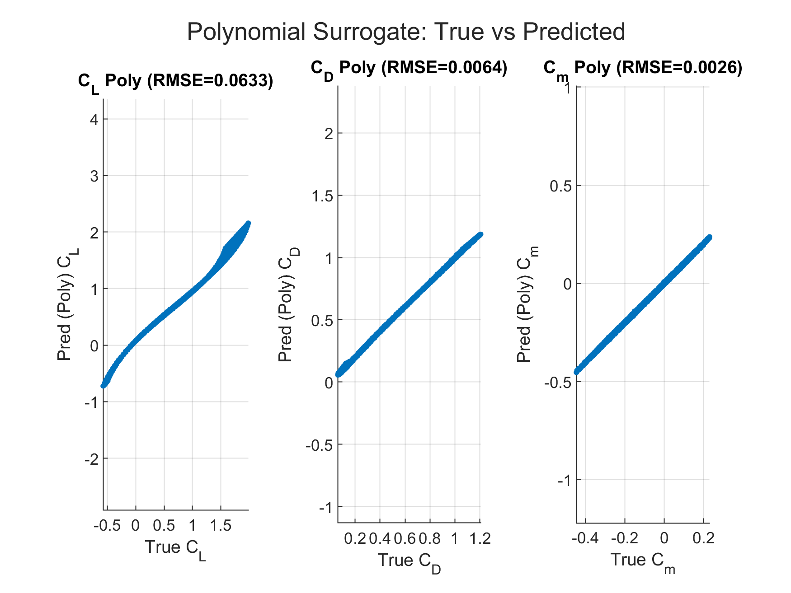

# Aerodynamic Surrogate Modeling for Hypersonic Flight

[Back to portfolio](../../README.md)

**Authors:** Ethan A. Wiseman and Brian N. Lopez  
**Tools:** MATLAB and Simulink  
**Paper:** [Read the supplied PDF](AI-Enhanced-Control-and-Aerodynamic-Optimization-for-Hypersonic-Flight.pdf)

## Objective and contribution

Develop a compact surrogate that predicts lift, drag, and pitching-moment coefficients, then integrate a polynomial model into Simulink. This implementation illustrates aerodynamic modeling concepts discussed in the AIAA student conference paper.

## Included files

| File | Purpose |
| --- | --- |
| [AeroCode.m](AeroCode.m) | Original training and evaluation script |
| [AeroModel.slx](AeroModel.slx) | Original Simulink model; metadata identifies MATLAB R2024b |
| [aeroSurrogateModel.mat](aeroSurrogateModel.mat) | Saved model with input normalization, polynomial weights, and an optional neural network |
| [Validation figure](figures/polynomial-validation.png) | Supplied polynomial validation plot |
| [Paper PDF](AI-Enhanced-Control-and-Aerodynamic-Optimization-for-Hypersonic-Flight.pdf) | Supplied research paper |

The source, model, saved parameters, figure, and paper are preserved byte for byte. Filenames have been simplified.

## Method

1. Generate 60,000 samples from nonlinear analytical equations over angle of attack −5° to 20°, Mach 3–8, and pitch rate −2 to 2 rad/s.
2. Add synthetic noise with random seed 7.
3. Split the data into 48,000 training and 12,000 validation samples.
4. Normalize inputs using training-set statistics.
5. Fit ten second-order polynomial features using ridge regularization, λ = 0.001.
6. Evaluate predictions of CL, CD, and Cm.

The script optionally trains a two-hidden-layer neural network with 15 neurons per layer using `fitnet` and `trainscg`. The polynomial model is the Simulink implementation. The saved polynomial weight matrix has shape 10 × 3.

## Reported validation results

| Coefficient | RMSE shown in supplied figure |
| --- | ---: |
| Lift, CL | 0.0633 |
| Drag, CD | 0.0064 |
| Pitching moment, Cm | 0.0026 |

These dimensionless values are transcribed from the supplied figure; MATLAB has not been rerun during repository preparation.



## Run in MATLAB

Use MATLAB R2024b as the starting compatibility target based on the Simulink file metadata. From this project folder, run:

```matlab
AeroCode
```

The script generates plots, prints validation RMSE, and overwrites `aeroSurrogateModel.mat` in the current folder. Copy the supplied MAT file first if you want to retain it. The polynomial path uses MATLAB; optional neural-network training requires the toolbox and license supporting `fitnet`. Simulink is required to open the SLX model.

## Open the Simulink model

```matlab
open_system('AeroModel.slx')
```

The model's MATLAB Function block contains embedded `muX`, `sgX`, and `W` constants. It does **not** automatically load the MAT file. After retraining, manually update those constants from `aeroModel.muX`, `aeroModel.sgX`, and `aeroModel.W` if you want the model to use the newly trained parameters. The supplied embedded constants are rounded.

MATLAB and Simulink execution have not been tested in this environment.

## Interpretation

The reference data are synthetic analytical equations, rather than CFD, wind-tunnel measurements, or flight tests. The random validation split assesses interpolation within that synthetic domain. It does not demonstrate real-aircraft accuracy or flight-control validation. The script's drift curve is an illustrative stress-test input.

The paper discusses broader AI and control approaches; the uploaded code implements a surrogate demonstration rather than a complete reinforcement-learning flight controller.
