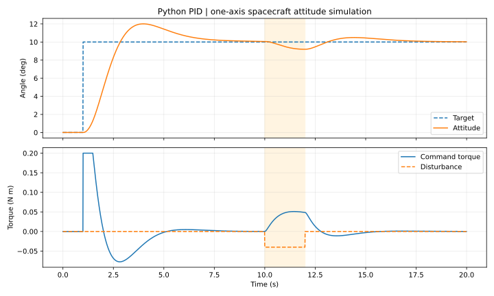

# Python PID Controller: Spacecraft Attitude Simulation

A reusable Python PID controller demonstrated on a simplified, one-axis spacecraft attitude model. The example tracks a 10-degree command, respects a torque limit, and recovers from an applied disturbance.

**Project status:** runnable educational simulation, created with AI assistance for this portfolio. This is a new example, separate from the AIAA research and its MATLAB/Simulink models. Results below are simulated; they are not hardware or flight-test results.

## Results



| Metric | Default simulation |
| --- | --- |
| Step overshoot | 20.1% |
| Step settling time, within 2% | 6.72 s |
| Settling after disturbance removal, within 2% | 4.49 s |
| Final target minus attitude | -0.0243 deg |
| Maximum absolute commanded torque | 0.200 N m |

The gains demonstrate tracking and disturbance recovery, with a visible overshoot tradeoff. They are a starting point for tuning, not an optimized design. Settling times are sampled estimates over the available observation windows: the initial response from 1 to 10 seconds and recovery from 12 to 20 seconds.

## Run

Use Python 3.9 or newer. The controller, simulation, CSV export, and tests use only the Python standard library.

From the repository root:

```bash
python projects/python-pid-controller/demo.py
python -m unittest discover -s projects/python-pid-controller -v
```

To regenerate the plot, install the optional plotting dependency:

```bash
python -m pip install matplotlib
python projects/python-pid-controller/demo.py --plot
```

Change gains and compare outputs in a separate directory:

```bash
python projects/python-pid-controller/demo.py --kp 2.4 --ki 0.4 --kd 2.5 --output comparison --plot
```

The demo writes `response.csv` and `metrics.json`; `--plot` also writes `response.svg`. The CSV contains time, target, attitude, angular rate, commanded torque, and disturbance torque. The checked-in plot and metrics correspond to the default gains.

## Control method

The controller uses error `e = target - measurement` and output `u = Kp*e + I - Kd*d_filtered`, with `I` stored directly in output units.

- Proportional action responds to the current tracking error.
- Integral action removes sustained error. Conditional integration freezes accumulation when it would push the command farther into saturation, while permitting it to unwind.
- Derivative action uses the measurement rather than the error, avoiding derivative kick when the target changes. A first-order filter smooths the estimated measurement rate.
- Output limits model finite actuator authority. `reset()` clears accumulated state between runs.

`pid.py` exposes `PIDController.update(setpoint, measurement, dt)`. `dt` is elapsed time in seconds; use a consistent sampling interval and gains appropriate to the signal units.

```python
from pid import PIDController

controller = PIDController(2.4, 0.8, 2.0, output_limits=(-0.2, 0.2))
torque = controller.update(setpoint=0.174533, measurement=0.0, dt=0.01)
```

## Plant and assumptions

The plant follows `J*theta_ddot + b*theta_dot = u + disturbance`, with angle in radians internally.

| Parameter | Value |
| --- | --- |
| Inertia J | 1.0 kg m^2 |
| Viscous damping b | 0.15 N m s/rad |
| Command torque limits | +/-0.2 N m |
| Sample interval | 0.01 s |
| Simulation duration | 20 s |
| Target command | 0 to 10 deg at t = 1 s |
| Disturbance | -0.04 N m from t = 10 to 12 s |
| Kp, Ki, Kd | 2.4, 0.8, 2.0, in compatible radian/second units |
| Derivative filter time constant | 0.05 s |

The plant advances using fourth-order Runge-Kutta integration with command and disturbance held constant during each interval. The damping term is an illustrative stabilizing load. The model omits three-axis coupling, reaction-wheel dynamics, sensor noise, delays, and orbital effects. It models small-angle attitude motion, not wrapped angle tracking.

## Verification

Eight tests cover proportional action and torque clipping, integral timing, saturation anti-windup and unwinding, setpoint derivative kick, derivative filtering/reset, invalid inputs, and end-to-end tracking/recovery. The simulation test also checks agreement after halving the time step.

## Files

- `pid.py`: reusable controller.
- `demo.py`: plant simulation, metrics, CSV export, and optional plotting.
- `test_pid.py`: automated controller and simulation tests.
- `results/`: default response plot and numerical metrics.
